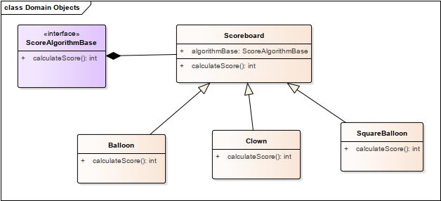

# Strategy-design-pattern-01
In this first example is implemented the strategy design pattern with an example of a game about the number of taps in
different balloons with an special multiplier in each of them.

This example is replicated from the instruction course of: [Learn Java Design Patterns: The Complete Guide](https://https://www.packtpub.com/product/learn-java-design-patterns-the-complete-guide-video/9781800567320)

#### UML design

